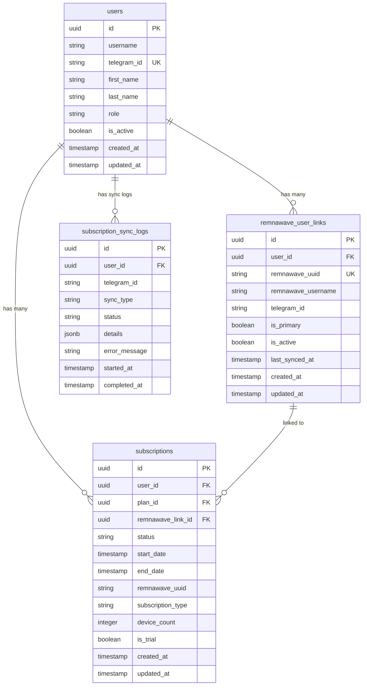
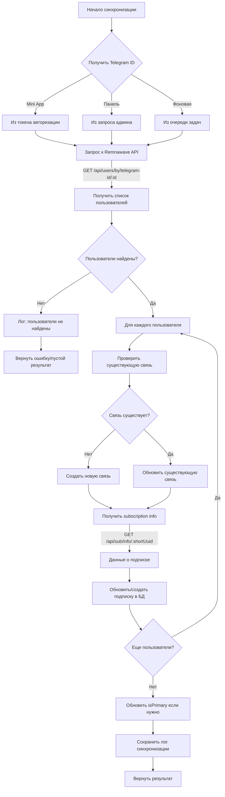
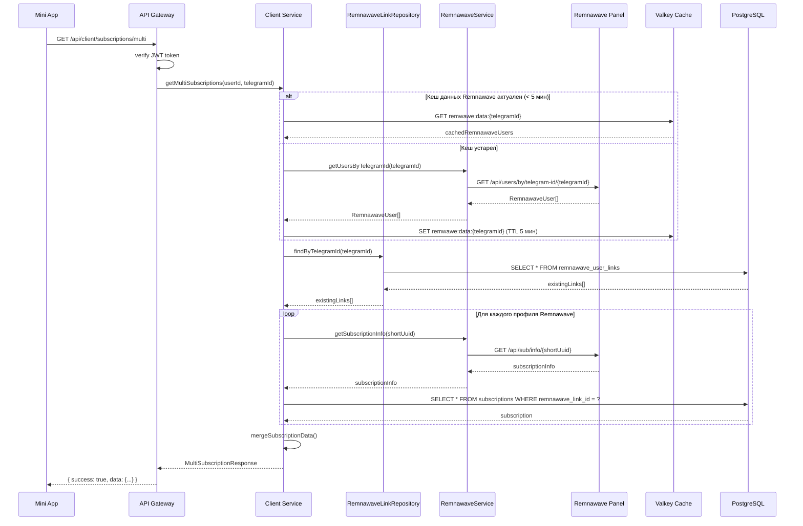

# Архитектура синхронизации множественных подписок Remnawave в Mini App

## Содержание
1. [Обзор](#обзор)
2. [Изменения в базе данных](#изменения-в-базе-данных)
3. [API endpoints для Mini App](#api-endpoints-для-mini-app)
4. [Логика синхронизации](#логика-синхронизации)
5. [Sequence Diagrams](#sequence-diagrams)
6. [Примеры кода](#примеры-кода)

---

## Обзор

### Проблема
В Remnawave одному Telegram ID может соответствовать несколько профилей (например, `vs7ka` и `vs7ka_pc` с telegramId `706003898`). В текущей реализации rezeis пользователь видит только одну подписку.

### Решение
Создать связующую сущность `RemnawaveUserLink`, которая связывает Telegram ID с несколькими профилями Remnawave. Каждый профиль Remnawave может иметь свою подписку в rezeis.

### Основные принципы
1. **Мультиподписка работает только для новых пользователей** (с префиксом)
2. **Обратная совместимость** - существующие пользователи продолжают работать
3. **Синхронизация по расписанию и по требованию**
4. **Кеширование данных от Remnawave**

---

## Изменения в базе данных

### ER-диаграмма



### SQL миграции

#### 1. Таблица связей Remnawave пользователей

```sql
-- Таблица для связи Telegram ID с несколькими профилями Remnawave
CREATE TABLE remnawave_user_links (
    id UUID PRIMARY KEY DEFAULT gen_random_uuid(),
    user_id UUID NOT NULL REFERENCES users(id) ON DELETE CASCADE,
    remnawave_uuid VARCHAR(255) NOT NULL UNIQUE,
    remnawave_username VARCHAR(255) NOT NULL,
    telegram_id VARCHAR(50),
    is_primary BOOLEAN DEFAULT false,
    is_active BOOLEAN DEFAULT true,
    last_synced_at TIMESTAMP WITH TIME ZONE,
    created_at TIMESTAMP WITH TIME ZONE DEFAULT NOW(),
    updated_at TIMESTAMP WITH TIME ZONE DEFAULT NOW()
);

-- Индексы для оптимизации
CREATE INDEX idx_remnawave_links_user_id ON remnawave_user_links(user_id);
CREATE INDEX idx_remnawave_links_telegram_id ON remnawave_user_links(telegram_id);
CREATE INDEX idx_remnawave_links_remwawe_uuid ON remnawave_user_links(remnawave_uuid);
CREATE INDEX idx_remnawave_links_is_primary ON remnawave_user_links(is_primary) WHERE is_primary = true;

-- Триггер для обновления updated_at
CREATE TRIGGER update_remnawave_user_links_updated_at
    BEFORE UPDATE ON remnawave_user_links
    FOR EACH ROW EXECUTE FUNCTION update_updated_at_column();
```

#### 2. Модификация таблицы subscriptions

```sql
-- Добавляем внешний ключ на remnawave_user_links
ALTER TABLE subscriptions 
    ADD COLUMN remnawave_link_id UUID REFERENCES remnawave_user_links(id) ON DELETE SET NULL;

-- Индекс для поиска подписок по связи
CREATE INDEX idx_subscriptions_remwawe_link_id ON subscriptions(remnawave_link_id);

-- Индекс для поиска активных подписок
CREATE INDEX idx_subscriptions_active ON subscriptions(user_id, status, end_date) 
    WHERE status = 'active' AND end_date > NOW();
```

#### 3. Таблица логов синхронизации

```sql
-- Таблица для логирования операций синхронизации
CREATE TABLE subscription_sync_logs (
    id UUID PRIMARY KEY DEFAULT gen_random_uuid(),
    user_id UUID REFERENCES users(id) ON DELETE SET NULL,
    telegram_id VARCHAR(50) NOT NULL,
    sync_type VARCHAR(50) NOT NULL, -- 'manual', 'scheduled', 'webhook'
    status VARCHAR(20) NOT NULL, -- 'pending', 'running', 'completed', 'failed'
    details JSONB DEFAULT '{}',
    error_message TEXT,
    started_at TIMESTAMP WITH TIME ZONE DEFAULT NOW(),
    completed_at TIMESTAMP WITH TIME ZONE,
    created_at TIMESTAMP WITH TIME ZONE DEFAULT NOW()
);

-- Индексы
CREATE INDEX idx_sync_logs_user_id ON subscription_sync_logs(user_id);
CREATE INDEX idx_sync_logs_telegram_id ON subscription_sync_logs(telegram_id);
CREATE INDEX idx_sync_logs_status ON subscription_sync_logs(status);
CREATE INDEX idx_sync_logs_created_at ON subscription_sync_logs(created_at DESC);
```

---

## TypeORM/TypeScript сущности

### 1. RemnawaveUserLink Entity

```typescript
// src/entities/remnawave-user-link.entity.ts

/**
 * Remnawave User Link entity
 * Связывает Telegram ID с профилем Remnawave
 */
export interface RemnawaveUserLink {
  id: string;
  userId: string;
  remnawaveUuid: string;
  remnawaveUsername: string;
  telegramId: string | null;
  isPrimary: boolean;
  isActive: boolean;
  lastSyncedAt: Date | null;
  createdAt: Date;
  updatedAt: Date;
}

/**
 * DTO для создания связи
 */
export interface CreateRemnawaveUserLinkDTO {
  userId: string;
  remnawaveUuid: string;
  remnawaveUsername: string;
  telegramId?: string;
  isPrimary?: boolean;
}

/**
 * DTO для обновления связи
 */
export interface UpdateRemnawaveUserLinkDTO {
  remnawaveUsername?: string;
  telegramId?: string;
  isPrimary?: boolean;
  isActive?: boolean;
  lastSyncedAt?: Date;
}

/**
 * Фильтры для поиска
 */
export interface RemnawaveUserLinkFilters {
  userId?: string;
  telegramId?: string;
  isActive?: boolean;
  isPrimary?: boolean;
}

/**
 * Результат синхронизации
 */
export interface SyncResult {
  success: boolean;
  linkedCount: number;
  unlinkedCount: number;
  errors: SyncError[];
}

export interface SyncError {
  remnawaveUuid: string;
  error: string;
}
```

### 2. SubscriptionSyncLog Entity

```typescript
// src/entities/subscription-sync-log.entity.ts

/**
 * Sync log entity for tracking synchronization operations
 */
export interface SubscriptionSyncLog {
  id: string;
  userId: string | null;
  telegramId: string;
  syncType: SyncType;
  status: SyncStatus;
  details: SyncDetails;
  errorMessage: string | null;
  startedAt: Date;
  completedAt: Date | null;
  createdAt: Date;
}

export type SyncType = 'manual' | 'scheduled' | 'webhook' | 'user_initiated';
export type SyncStatus = 'pending' | 'running' | 'completed' | 'failed' | 'partial';

export interface SyncDetails {
  processedCount?: number;
  createdCount?: number;
  updatedCount?: number;
  skippedCount?: number;
  errors?: SyncErrorDetail[];
  remnawaveUsers?: RemnawaveUserInfo[];
}

export interface SyncErrorDetail {
  telegramId?: string;
  remnawaveUuid?: string;
  error: string;
  code?: string;
}

export interface RemnawaveUserInfo {
  uuid: string;
  username: string;
  status: string;
  telegramId: string | null;
}

export interface CreateSyncLogDTO {
  userId?: string;
  telegramId: string;
  syncType: SyncType;
  status: SyncStatus;
  details?: SyncDetails;
  errorMessage?: string;
}

export interface UpdateSyncLogDTO {
  status?: SyncStatus;
  details?: SyncDetails;
  errorMessage?: string;
  completedAt?: Date;
}
```

---

## API endpoints для Mini App

### 1. Получение всех подписок по Telegram ID

```typescript
/**
 * GET /api/client/subscriptions/multi
 * Получение всех подписок пользователя (включая мультиподписки)
 * 
 * Response:
 * {
 *   success: true,
 *   data: {
 *     user: {
 *       id: string;
 *       telegramId: string;
 *       username: string;
 *     };
 *     subscriptions: MultiSubscriptionItem[];
 *     totalCount: number;
 *     activeCount: number;
 *     lastSyncedAt: string | null;
 *   }
 * }
 */

export interface MultiSubscriptionItem {
  // Информация о связи с Remnawave
  link: {
    id: string;
    remnawaveUuid: string;
    remnawaveUsername: string;
    isPrimary: boolean;
  };
  
  // Информация о подписке в rezeis
  subscription: {
    id: string;
    status: 'active' | 'expired' | 'cancelled' | 'pending';
    planName: string;
    startDate: string;
    endDate: string;
    daysLeft: number;
    trafficLimitGb: number;
    trafficUsedGb: number;
    trafficRemainingGb: number;
    deviceCount: number;
    isTrial: boolean;
  } | null;
  
  // Информация от Remnawave (real-time)
  remnawaveInfo: {
    uuid: string;
    username: string;
    status: 'ACTIVE' | 'DISABLED' | 'LIMITED' | 'EXPIRED';
    trafficUsed: number;
    trafficLimit: number;
    expireAt: string | null;
    subscriptionUrl: string;
    shortUuid: string;
  } | null;
  
  // Действия
  actions: {
    canRenew: boolean;
    canExtend: boolean;
    canViewQR: boolean;
    qrUrl: string | null;
  };
}
```

### 2. Ручная синхронизация подписок

```typescript
/**
 * POST /api/client/subscriptions/multi/sync
 * Принудительная синхронизация подписок с Remnawave
 * 
 * Body: { forceRefresh?: boolean }
 * 
 * Response:
 * {
 *   success: true,
 *   data: {
 *     syncedAt: string;
 *     foundProfiles: number;
 *     linkedProfiles: number;
 *     subscriptions: MultiSubscriptionItem[];
 *   }
 * }
 */
```

### 3. Установка основной подписки

```typescript
/**
 * POST /api/client/subscriptions/multi/primary
 * Установка основной (по умолчанию) подписки
 * 
 * Body: { linkId: string }
 * 
 * Response:
 * {
 *   success: true,
 *   data: {
 *     previousPrimaryId: string | null;
 *     newPrimaryId: string;
 *   }
 * }
 */
```

### 4. Получение детальной информации о подписке

```typescript
/**
 * GET /api/client/subscriptions/multi/:linkId
 * Детальная информация о конкретной подписке
 * 
 * Response:
 * {
 *   success: true,
 *   data: MultiSubscriptionItem & {
 *     history: SubscriptionHistoryItem[];
 *     devices: ConnectedDevice[];
 *   }
 * }
 */

export interface SubscriptionHistoryItem {
  id: string;
  action: 'created' | 'renewed' | 'extended' | 'cancelled';
  timestamp: string;
  details: Record<string, unknown>;
}

export interface ConnectedDevice {
  id: string;
  platform: string | null;
  deviceModel: string | null;
  lastConnectedAt: string;
}
```

---

## Логика синхронизации

### Общий алгоритм



### Обработка конфликтов

| Сценарий | Действие |
|----------|----------|
| Один Telegram ID, несколько профилей Remnawave | Создать связь для каждого профиля, пометить первый как `isPrimary: true` |
| Профиль Remnawave уже связан с другим user | Логировать конфликт, создать флаг `needsReview: true` |
| Профиль Remnawave не найден в Remnawave | Пометить связь как `isActive: false` |
| Telegram ID изменился у профиля Remnawave | Обновить связь, старые подписки архивировать |
| Профиль без telegramId в Remnawave | Пропустить (только для явной привязки) |

### Стратегия primary подписки

```typescript
/**
 * Алгоритм выбора primary подписки:
 * 1. Если есть активная подписка - она primary
 * 2. Если несколько активных - та, что дольше всего активна
 * 3. Если нет активных - последняя созданная связь
 */
async function determinePrimaryLink(links: RemnawaveUserLink[]): Promise<string | null> {
  const activeLinks = links.filter(l => l.isActive);
  
  // Сортировка по приоритету
  const sorted = activeLinks.sort((a, b) => {
    // Сначала активные подписки
    const aHasActiveSub = a.subscription?.status === 'active';
    const bHasActiveSub = b.subscription?.status === 'active';
    
    if (aHasActiveSub && !bHasActiveSub) return -1;
    if (!aHasActiveSub && bHasActiveSub) return 1;
    
    // Затем по дате окончания (дальше = лучше)
    if (a.subscription?.endDate && b.subscription?.endDate) {
      return b.subscription.endDate.getTime() - a.subscription.endDate.getTime();
    }
    
    // Или по дате создания связи
    return b.createdAt.getTime() - a.createdAt.getTime();
  });
  
  return sorted[0]?.id || null;
}
```

---

## Sequence Diagrams

### 1. Получение подписок в Mini App



### 2. Процесс синхронизации

```mermaid
sequenceDiagram
    participant Admin as Admin Panel
    participant Sync as Sync Service
    participant Log as Sync Log Repository
    participant RS as Remnawave Service
    participant RW as Remnawave Panel
    participant Link as Remnawave Link Repo
    participant Sub as Subscription Repo
    participant DB as PostgreSQL
    participant Event as Event Service

    Admin->>Sync: syncByTelegramId(telegramId)
    Sync->>Log: createSyncLog({telegramId, type: 'manual'})
    Log->>DB: INSERT INTO subscription_sync_logs
    DB-->>Log: logId
    Log-->>Sync: logId
    
    Sync->>RS: getUsersByTelegramId(telegramId)
    RS->>RW: GET /api/users/by/telegram-id/{telegramId}
    RW-->>RS: RemnawaveUser[]
    RS-->>Sync: RemnawaveUser[]
    
    Sync->>Link: findByTelegramId(telegramId)
    Link->>DB: SELECT * FROM remnawave_user_links
    DB-->>Link: existingLinks[]
    Link-->>Sync: existingLinks[]
    
    loop Обработка каждого профиля
        Sync->>Sync: matchOrCreateLink()
        
        alt Новый профиль
            Sync->>Link: create({userId, remnawaveUuid, ...})
            Link->>DB: INSERT INTO remnawave_user_links
        else Существующий профиль
            Sync->>Link: update(linkId, {...})
            Link->>DB: UPDATE remnawave_user_links
        end
        
        Sync->>RS: getSubscriptionInfo(shortUuid)
        RS->>RW: GET /api/sub/info/{shortUuid}
        RW-->>RS: info
        RS-->>Sync: info
        
        alt Подписка не существует
            Sync->>Sub: create({remnawaveLinkId, ...})
            Sub->>DB: INSERT INTO subscriptions
        else Подписка существует
            Sync->>Sub: update(subId, {...})
            Sub->>DB: UPDATE subscriptions
        end
    end
    
    Sync->>Sync: updatePrimaryLink()
    Sync->>Log: updateSyncLog(logId, {status: 'completed'})
    Log->>DB: UPDATE subscription_sync_logs
    
    Sync->>Event: emit('subscriptions.synced', {userId, telegramId})
    Sync-->>Admin: SyncResult
```

### 3. Фоновая синхронизация (по расписанию)

```mermaid
sequenceDiagram
    participant Job as Cron Job
    participant Sync as Batch Sync Service
    participant User as User Repository
    participant RS as Remnawave Service
    participant RW as Remnawave Panel
    participant Link as Remnawave Link Repo
    participant DB as PostgreSQL
    participant Cache as Valkey

    Job->>Sync: runScheduledSync()
    Sync->>User: getUsersWithTelegramId()
    User->>DB: SELECT * FROM users WHERE telegram_id IS NOT NULL
    DB-->>User: users[]
    User-->>Sync: users[]
    
    loop Для каждого пользователя (batch)
        Sync->>Cache: GET sync:lock:{telegramId}
        
        alt Нет блокировки
            Sync->>Cache: SET sync:lock:{telegramId} (TTL 10 мин)
            Sync->>RS: getUsersByTelegramId(telegramId)
            RS->>RW: GET /api/users/by/telegram-id/{telegramId}
            RW-->>RS: users[]
            RS-->>Sync: users[]
            
            Sync->>Link: bulkUpsert(links[])
            Link->>DB: INSERT ... ON CONFLICT UPDATE
            
            Sync->>Cache: DEL sync:lock:{telegramId}
        else Есть блокировка
            Sync->>Sync: skip (already syncing)
        end
    end
    
    Sync-->>Job: BatchSyncResult
```

---

## Примеры кода

### 1. Репозиторий для работы со связями

```typescript
// src/repositories/remnawave-user-link.repository.ts

import type { QueryResultRow } from 'pg';
import { BaseRepository, RepositoryError } from './base.repository.js';
import type { 
  RemnawaveUserLink, 
  CreateRemnawaveUserLinkDTO, 
  UpdateRemnawaveUserLinkDTO,
  RemnawaveUserLinkFilters 
} from '../entities/remnawave-user-link.entity.js';
import { logger } from '../utils/logger.js';

export class RemnawaveUserLinkRepository extends BaseRepository<
  RemnawaveUserLink, 
  CreateRemnawaveUserLinkDTO, 
  UpdateRemnawaveUserLinkDTO
> {
  protected readonly tableName = 'remnawave_user_links';

  protected mapRowToEntity(row: QueryResultRow): RemnawaveUserLink {
    return {
      id: row.id,
      userId: row.user_id,
      remnawaveUuid: row.remnawave_uuid,
      remnawaveUsername: row.remnawave_username,
      telegramId: row.telegram_id,
      isPrimary: row.is_primary,
      isActive: row.is_active,
      lastSyncedAt: row.last_synced_at,
      createdAt: row.created_at,
      updatedAt: row.updated_at,
    };
  }

  /**
   * Найти связи по Telegram ID
   */
  async findByTelegramId(telegramId: string): Promise<RemnawaveUserLink[]> {
    try {
      const result = await this.db.query<QueryResultRow>(
        `SELECT * FROM ${this.tableName} 
         WHERE telegram_id = $1 AND is_active = true
         ORDER BY is_primary DESC, created_at ASC`,
        [telegramId]
      );
      return result.rows.map((row) => this.mapRowToEntity(row));
    } catch (error) {
      logger.error({ error, telegramId }, 'Failed to find links by Telegram ID');
      throw new RepositoryError('Failed to find links by Telegram ID', error);
    }
  }

  /**
   * Найти связь по Remnawave UUID
   */
  async findByRemnawaveUuid(uuid: string): Promise<RemnawaveUserLink | null> {
    try {
      const result = await this.db.query<QueryResultRow>(
        `SELECT * FROM ${this.tableName} WHERE remnawave_uuid = $1`,
        [uuid]
      );
      return result.rows[0] ? this.mapRowToEntity(result.rows[0]) : null;
    } catch (error) {
      logger.error({ error, uuid }, 'Failed to find link by Remnawave UUID');
      throw new RepositoryError('Failed to find link by Remnawave UUID', error);
    }
  }

  /**
   * Найти связи с подписками для пользователя
   */
  async findWithSubscriptions(userId: string): Promise<RemnawaveUserLinkWithSubscription[]> {
    try {
      const result = await this.db.query<QueryResultRow>(
        `SELECT 
           rul.*,
           s.id as sub_id,
           s.status as sub_status,
           s.start_date as sub_start_date,
           s.end_date as sub_end_date,
           s.traffic_limit_gb as sub_traffic_limit_gb,
           s.traffic_used_gb as sub_traffic_used_gb
         FROM ${this.tableName} rul
         LEFT JOIN subscriptions s ON s.remnawave_link_id = rul.id
         WHERE rul.user_id = $1 AND rul.is_active = true
         ORDER BY rul.is_primary DESC, rul.created_at ASC`,
        [userId]
      );
      
      return result.rows.map((row) => ({
        ...this.mapRowToEntity(row),
        subscription: row.sub_id ? {
          id: row.sub_id,
          status: row.sub_status,
          startDate: row.sub_start_date,
          endDate: row.sub_end_date,
          trafficLimitGb: row.sub_traffic_limit_gb,
          trafficUsedGb: row.sub_traffic_used_gb,
        } : null,
      }));
    } catch (error) {
      logger.error({ error, userId }, 'Failed to find links with subscriptions');
      throw new RepositoryError('Failed to find links with subscriptions', error);
    }
  }

  /**
   * Установить primary флаг
   */
  async setPrimary(linkId: string, userId: string): Promise<void> {
    const client = await this.db.connect();
    try {
      await client.query('BEGIN');
      
      // Снять primary с других связей
      await client.query(
        `UPDATE ${this.tableName} 
         SET is_primary = false, updated_at = NOW()
         WHERE user_id = $1 AND id != $2`,
        [userId, linkId]
      );
      
      // Установить primary на текущую
      await client.query(
        `UPDATE ${this.tableName} 
         SET is_primary = true, updated_at = NOW()
         WHERE id = $1`,
        [linkId]
      );
      
      await client.query('COMMIT');
    } catch (error) {
      await client.query('ROLLBACK');
      logger.error({ error, linkId, userId }, 'Failed to set primary link');
      throw new RepositoryError('Failed to set primary link', error);
    } finally {
      client.release();
    }
  }

  /**
   * Bulk upsert связей
   */
  async bulkUpsert(links: CreateRemnawaveUserLinkDTO[]): Promise<RemnawaveUserLink[]> {
    const client = await this.db.connect();
    try {
      await client.query('BEGIN');
      
      const results: RemnawaveUserLink[] = [];
      
      for (const link of links) {
        const result = await client.query<QueryResultRow>(
          `INSERT INTO ${this.tableName} 
           (user_id, remnawave_uuid, remnawave_username, telegram_id, is_primary, is_active, last_synced_at)
           VALUES ($1, $2, $3, $4, $5, $6, NOW())
           ON CONFLICT (remnawave_uuid) 
           DO UPDATE SET
             remnawave_username = EXCLUDED.remnawave_username,
             telegram_id = EXCLUDED.telegram_id,
             is_active = EXCLUDED.is_active,
             last_synced_at = NOW(),
             updated_at = NOW()
           RETURNING *`,
          [
            link.userId,
            link.remnawaveUuid,
            link.remnawaveUsername,
            link.telegramId,
            link.isPrimary || false,
            true,
          ]
        );
        
        results.push(this.mapRowToEntity(result.rows[0]));
      }
      
      await client.query('COMMIT');
      return results;
    } catch (error) {
      await client.query('ROLLBACK');
      logger.error({ error, count: links.length }, 'Failed to bulk upsert links');
      throw new RepositoryError('Failed to bulk upsert links', error);
    } finally {
      client.release();
    }
  }
}

export interface RemnawaveUserLinkWithSubscription extends RemnawaveUserLink {
  subscription: {
    id: string;
    status: string;
    startDate: Date;
    endDate: Date;
    trafficLimitGb: number | null;
    trafficUsedGb: number;
  } | null;
}
```

### 2. Сервис синхронизации

```typescript
// src/services/multi-subscription-sync.service.ts

import { Pool } from 'pg';
import { RemnawaveService } from './remnawave.service.js';
import { RemnawaveUserLinkRepository } from '../repositories/remnawave-user-link.repository.js';
import { SubscriptionRepository } from '../repositories/subscription.repository.js';
import { SubscriptionSyncLogRepository } from '../repositories/subscription-sync-log.repository.js';
import { CacheService } from '../cache/cache.service.js';
import type { 
  SyncResult, 
  SyncError,
  RemnawaveUserLink 
} from '../entities/remnawave-user-link.entity.js';
import type { Subscription } from '../entities/subscription.entity.js';
import { logger } from '../utils/logger.js';

export interface SyncOptions {
  forceRefresh?: boolean;
  syncType?: 'manual' | 'scheduled' | 'webhook' | 'user_initiated';
}

export interface MultiSubscriptionData {
  link: RemnawaveUserLink;
  subscription: Subscription | null;
  remnawaveInfo: RemnawaveUserInfo | null;
}

export interface RemnawaveUserInfo {
  uuid: string;
  username: string;
  shortUuid: string;
  status: 'ACTIVE' | 'DISABLED' | 'LIMITED' | 'EXPIRED';
  trafficUsed: number;
  trafficLimit: number;
  expireAt: string | null;
  subscriptionUrl: string;
  telegramId: number | null;
}

export class MultiSubscriptionSyncService {
  private readonly remnawaveService: RemnawaveService;
  private readonly linkRepository: RemnawaveUserLinkRepository;
  private readonly subscriptionRepository: SubscriptionRepository;
  private readonly syncLogRepository: SubscriptionSyncLogRepository;
  private readonly cacheService: CacheService;
  
  private readonly CACHE_TTL_SECONDS = 300; // 5 минут
  private readonly LOCK_TTL_SECONDS = 600; // 10 минут

  constructor(pool: Pool, cacheService: CacheService) {
    this.remnawaveService = new RemnawaveService(pool);
    this.linkRepository = new RemnawaveUserLinkRepository(pool);
    this.subscriptionRepository = new SubscriptionRepository(pool);
    this.syncLogRepository = new SubscriptionSyncLogRepository(pool);
    this.cacheService = cacheService;
  }

  /**
   * Синхронизировать подписки для Telegram ID
   */
  async syncByTelegramId(
    telegramId: string, 
    userId: string,
    options: SyncOptions = {}
  ): Promise<SyncResult> {
    const { syncType = 'manual' } = options;
    
    // Создаем лог
    const log = await this.syncLogRepository.create({
      telegramId,
      userId,
      syncType,
      status: 'running',
    });

    try {
      // Проверяем блокировку
      const lockKey = `sync:lock:${telegramId}`;
      const existingLock = await this.cacheService.get(lockKey);
      
      if (existingLock) {
        throw new Error('Synchronization already in progress');
      }
      
      // Устанавливаем блокировку
      await this.cacheService.set(lockKey, '1', this.LOCK_TTL_SECONDS);

      // Получаем пользователей из Remnawave
      const remnawaveUsers = await this.remnawaveService.getUsersByTelegramId(telegramId);
      
      if (remnawaveUsers.length === 0) {
        await this.syncLogRepository.update(log.id, {
          status: 'completed',
          details: { processedCount: 0, foundProfiles: 0 },
          completedAt: new Date(),
        });
        
        return {
          success: true,
          linkedCount: 0,
          unlinkedCount: 0,
          errors: [],
        };
      }

      const errors: SyncError[] = [];
      let linkedCount = 0;
      
      // Обрабатываем каждый профиль
      for (const rwUser of remnawaveUsers) {
        try {
          await this.processRemnawaveUser(rwUser, userId, telegramId);
          linkedCount++;
        } catch (error) {
          errors.push({
            remnawaveUuid: rwUser.uuid,
            error: error instanceof Error ? error.message : 'Unknown error',
          });
        }
      }

      // Обновляем primary связь
      await this.updatePrimaryLink(userId);

      // Кешируем результат
      await this.cacheService.set(
        `remnawave:data:${telegramId}`,
        JSON.stringify(remnawaveUsers),
        this.CACHE_TTL_SECONDS
      );

      // Снимаем блокировку
      await this.cacheService.del(lockKey);

      // Обновляем лог
      await this.syncLogRepository.update(log.id, {
        status: errors.length > 0 ? 'partial' : 'completed',
        details: {
          processedCount: remnawaveUsers.length,
          linkedCount,
          errorCount: errors.length,
          errors,
        },
        completedAt: new Date(),
      });

      return {
        success: errors.length === 0,
        linkedCount,
        unlinkedCount: remnawaveUsers.length - linkedCount,
        errors,
      };
    } catch (error) {
      // Снимаем блокировку
      await this.cacheService.del(`sync:lock:${telegramId}`);
      
      // Обновляем лог с ошибкой
      await this.syncLogRepository.update(log.id, {
        status: 'failed',
        errorMessage: error instanceof Error ? error.message : 'Unknown error',
        completedAt: new Date(),
      });

      throw error;
    }
  }

  /**
   * Обработка одного пользователя Remnawave
   */
  private async processRemnawaveUser(
    rwUser: RemnawaveUser,
    userId: string,
    telegramId: string
  ): Promise<void> {
    // Проверяем существующую связь
    let link = await this.linkRepository.findByRemnawaveUuid(rwUser.uuid);
    
    if (!link) {
      // Создаем новую связь
      const isFirst = !(await this.linkRepository.findByUserId(userId)).length;
      
      link = await this.linkRepository.create({
        userId,
        remnawaveUuid: rwUser.uuid,
        remnawaveUsername: rwUser.username,
        telegramId,
        isPrimary: isFirst,
      });
    } else {
      // Обновляем существующую
      link = await this.linkRepository.update(link.id, {
        remnawaveUsername: rwUser.username,
        telegramId,
        lastSyncedAt: new Date(),
      });
    }

    // Получаем информацию о подписке
    const subInfo = await this.remnawaveService.getSubscriptionInfo(rwUser.shortUuid);
    
    // Обновляем или создаем подписку
    await this.syncSubscription(link, subInfo, userId);
  }

  /**
   * Синхронизация подписки
   */
  private async syncSubscription(
    link: RemnawaveUserLink,
    subInfo: RemnawaveSubscriptionInfo | null,
    userId: string
  ): Promise<void> {
    if (!subInfo) return;

    const existingSub = await this.subscriptionRepository.findByRemnawaveLinkId(link.id);
    
    const subscriptionData = {
      userId,
      remnawaveLinkId: link.id,
      remnawaveUuid: link.remnawaveUuid,
      status: this.mapRemnawaveStatus(subInfo.status),
      startDate: new Date(subInfo.createdAt),
      endDate: subInfo.expireAt ? new Date(subInfo.expireAt) : new Date(Date.now() + 30 * 24 * 60 * 60 * 1000),
      trafficLimitGb: subInfo.trafficLimit ? subInfo.trafficLimit / (1024 ** 3) : null,
      trafficUsedGb: subInfo.trafficUsed ? subInfo.trafficUsed / (1024 ** 3) : 0,
    };

    if (existingSub.length > 0) {
      await this.subscriptionRepository.update(existingSub[0].id, subscriptionData);
    } else {
      await this.subscriptionRepository.create({
        ...subscriptionData,
        planId: 'default', // или определить по конфигурации
        subscriptionType: 'regular',
        deviceCount: 1,
        isTrial: false,
        subscriptionIndex: 1,
        promoDiscountPercent: 0,
        promoDiscountAmount: 0,
        trafficUsedGb: 0,
      });
    }
  }

  /**
   * Получить все подписки пользователя (для Mini App)
   */
  async getMultiSubscriptions(userId: string, telegramId: string): Promise<MultiSubscriptionData[]> {
    // Получаем связи с подписками
    const links = await this.linkRepository.findWithSubscriptions(userId);
    
    // Получаем данные Remnawave (из кеша или API)
    const remnawaveData = await this.getRemnawaveData(telegramId);
    
    // Формируем результат
    const result: MultiSubscriptionData[] = [];
    
    for (const link of links) {
      const rwInfo = remnawaveData.find(r => r.uuid === link.remnawaveUuid);
      
      result.push({
        link,
        subscription: link.subscription as Subscription | null,
        remnawaveInfo: rwInfo || null,
      });
    }
    
    return result;
  }

  /**
   * Получить данные Remnawave (с кешированием)
   */
  private async getRemnawaveData(telegramId: string): Promise<RemnawaveUserInfo[]> {
    const cacheKey = `remnawave:data:${telegramId}`;
    const cached = await this.cacheService.get(cacheKey);
    
    if (cached) {
      try {
        return JSON.parse(cached);
      } catch {
        // Продолжаем запрос к API
      }
    }
    
    const users = await this.remnawaveService.getUsersByTelegramId(telegramId);
    
    // Получаем доп. информацию для каждого пользователя
    const enrichedUsers: RemnawaveUserInfo[] = [];
    
    for (const user of users) {
      const info = await this.remnawaveService.getSubscriptionInfo(user.shortUuid);
      
      enrichedUsers.push({
        uuid: user.uuid,
        username: user.username,
        shortUuid: user.shortUuid,
        status: user.status,
        trafficUsed: user.trafficUsed,
        trafficLimit: user.trafficLimit,
        expireAt: user.expireAt,
        subscriptionUrl: info?.subscriptionUrl || '',
        telegramId: user.telegramId,
      });
    }
    
    // Кешируем
    await this.cacheService.set(cacheKey, JSON.stringify(enrichedUsers), this.CACHE_TTL_SECONDS);
    
    return enrichedUsers;
  }

  /**
   * Обновить primary связь
   */
  private async updatePrimaryLink(userId: string): Promise<void> {
    const links = await this.linkRepository.findWithSubscriptions(userId);
    
    if (links.length === 0) return;
    
    // Ищем связь с активной подпиской
    const activeLink = links.find(l => 
      l.subscription?.status === 'active' && 
      new Date(l.subscription.endDate) > new Date()
    );
    
    if (activeLink && !activeLink.isPrimary) {
      await this.linkRepository.setPrimary(activeLink.id, userId);
    } else if (!activeLink && links.length > 0 && !links[0].isPrimary) {
      // Если нет активных, делаем primary первую
      await this.linkRepository.setPrimary(links[0].id, userId);
    }
  }

  /**
   * Маппинг статусов Remnawave в локальные
   */
  private mapRemnawaveStatus(rwStatus: string): 'active' | 'expired' | 'cancelled' | 'pending' {
    const statusMap: Record<string, 'active' | 'expired' | 'cancelled' | 'pending'> = {
      'ACTIVE': 'active',
      'DISABLED': 'cancelled',
      'LIMITED': 'active',
      'EXPIRED': 'expired',
    };
    
    return statusMap[rwStatus] || 'pending';
  }
}
```

### 3. Контроллер для Mini App

```typescript
// src/modules/client/multi-subscription.controller.ts

import type { FastifyRequest, FastifyReply } from 'fastify';
import type { Pool } from 'pg';
import { MultiSubscriptionSyncService } from '../../services/multi-subscription-sync.service.js';
import { RemnawaveUserLinkRepository } from '../../repositories/remnawave-user-link.repository.js';
import { CacheService } from '../../cache/cache.service.js';
import { logger } from '../../utils/logger.js';

export interface MultiSubscriptionResponse {
  success: boolean;
  data: {
    user: {
      id: string;
      telegramId: string;
      username: string;
    };
    subscriptions: MultiSubscriptionItem[];
    totalCount: number;
    activeCount: number;
    lastSyncedAt: string | null;
  };
}

export interface MultiSubscriptionItem {
  link: {
    id: string;
    remnawaveUuid: string;
    remnawaveUsername: string;
    isPrimary: boolean;
  };
  subscription: {
    id: string;
    status: string;
    planName: string;
    startDate: string;
    endDate: string;
    daysLeft: number;
    trafficLimitGb: number | null;
    trafficUsedGb: number;
    trafficRemainingGb: number;
    deviceCount: number;
    isTrial: boolean;
  } | null;
  remnawaveInfo: {
    uuid: string;
    username: string;
    status: string;
    trafficUsed: number;
    trafficLimit: number;
    expireAt: string | null;
    subscriptionUrl: string;
    shortUuid: string;
  } | null;
  actions: {
    canRenew: boolean;
    canExtend: boolean;
    canViewQR: boolean;
    qrUrl: string | null;
  };
}

export class MultiSubscriptionController {
  private readonly syncService: MultiSubscriptionSyncService;
  private readonly linkRepository: RemnawaveUserLinkRepository;
  private readonly cacheService: CacheService;

  constructor(pool: Pool, cacheService: CacheService) {
    this.syncService = new MultiSubscriptionSyncService(pool, cacheService);
    this.linkRepository = new RemnawaveUserLinkRepository(pool);
    this.cacheService = cacheService;
  }

  /**
   * GET /api/client/subscriptions/multi
   * Получить все подписки пользователя
   */
  async getMultiSubscriptions(
    request: FastifyRequest,
    reply: FastifyReply
  ): Promise<void> {
    try {
      const userId = request.user?.userId;
      const telegramId = request.user?.telegramId;

      if (!userId || !telegramId) {
        reply.status(401).send({ success: false, error: 'Unauthorized' });
        return;
      }

      // Получаем данные
      const multiSubs = await this.syncService.getMultiSubscriptions(userId, telegramId);
      
      // Форматируем ответ
      const subscriptions: MultiSubscriptionItem[] = multiSubs.map((item) => ({
        link: {
          id: item.link.id,
          remnawaveUuid: item.link.remnawaveUuid,
          remnawaveUsername: item.link.remnawaveUsername,
          isPrimary: item.link.isPrimary,
        },
        subscription: item.subscription ? {
          id: item.subscription.id,
          status: item.subscription.status,
          planName: item.subscription.snapshot?.name as string || 'Unknown',
          startDate: item.subscription.startDate.toISOString(),
          endDate: item.subscription.endDate.toISOString(),
          daysLeft: this.calculateDaysLeft(item.subscription.endDate),
          trafficLimitGb: item.subscription.trafficLimitGb,
          trafficUsedGb: item.subscription.trafficUsedGb,
          trafficRemainingGb: this.calculateRemainingTraffic(
            item.subscription.trafficLimitGb,
            item.subscription.trafficUsedGb
          ),
          deviceCount: item.subscription.deviceCount,
          isTrial: item.subscription.isTrial,
        } : null,
        remnawaveInfo: item.remnawaveInfo ? {
          uuid: item.remnawaveInfo.uuid,
          username: item.remnawaveInfo.username,
          status: item.remnawaveInfo.status,
          trafficUsed: item.remnawaveInfo.trafficUsed,
          trafficLimit: item.remnawaveInfo.trafficLimit,
          expireAt: item.remnawaveInfo.expireAt,
          subscriptionUrl: item.remnawaveInfo.subscriptionUrl,
          shortUuid: item.remnawaveInfo.shortUuid,
        } : null,
        actions: {
          canRenew: item.subscription?.status === 'active' || item.subscription?.status === 'expired',
          canExtend: item.subscription?.status === 'active',
          canViewQR: !!item.remnawaveInfo?.shortUuid,
          qrUrl: item.remnawaveInfo?.shortUuid 
            ? `/api/client/subscriptions/multi/${item.link.id}/qr`
            : null,
        },
      }));

      const activeCount = subscriptions.filter(
        s => s.subscription?.status === 'active'
      ).length;

      const lastSync = multiSubs.length > 0 
        ? multiSubs[0].link.lastSyncedAt?.toISOString() || null
        : null;

      const response: MultiSubscriptionResponse = {
        success: true,
        data: {
          user: {
            id: userId,
            telegramId,
            username: request.user?.username || '',
          },
          subscriptions,
          totalCount: subscriptions.length,
          activeCount,
          lastSyncedAt: lastSync,
        },
      };

      reply.send(response);
    } catch (error) {
      logger.error({ error }, 'Failed to get multi subscriptions');
      reply.status(500).send({
        success: false,
        error: 'Failed to get subscriptions',
      });
    }
  }

  /**
   * POST /api/client/subscriptions/multi/sync
   * Принудительная синхронизация
   */
  async syncSubscriptions(
    request: FastifyRequest<{ Body: { forceRefresh?: boolean } }>,
    reply: FastifyReply
  ): Promise<void> {
    try {
      const userId = request.user?.userId;
      const telegramId = request.user?.telegramId;

      if (!userId || !telegramId) {
        reply.status(401).send({ success: false, error: 'Unauthorized' });
        return;
      }

      const { forceRefresh = false } = request.body;

      // Запускаем синхронизацию
      const result = await this.syncService.syncByTelegramId(userId, telegramId, {
        syncType: 'user_initiated',
        forceRefresh,
      });

      if (!result.success) {
        reply.status(400).send({
          success: false,
          error: 'Synchronization partially failed',
          details: result.errors,
        });
        return;
      }

      // Получаем обновленные данные
      await this.getMultiSubscriptions(request, reply);
    } catch (error) {
      logger.error({ error }, 'Failed to sync subscriptions');
      reply.status(500).send({
        success: false,
        error: error instanceof Error ? error.message : 'Synchronization failed',
      });
    }
  }

  /**
   * POST /api/client/subscriptions/multi/primary
   * Установить primary подписку
   */
  async setPrimarySubscription(
    request: FastifyRequest<{ Body: { linkId: string } }>,
    reply: FastifyReply
  ): Promise<void> {
    try {
      const userId = request.user?.userId;
      const { linkId } = request.body;

      if (!userId) {
        reply.status(401).send({ success: false, error: 'Unauthorized' });
        return;
      }

      // Проверяем, что связь принадлежит пользователю
      const link = await this.linkRepository.findById(linkId);
      
      if (!link || link.userId !== userId) {
        reply.status(404).send({ success: false, error: 'Link not found' });
        return;
      }

      await this.linkRepository.setPrimary(linkId, userId);

      reply.send({
        success: true,
        data: {
          message: 'Primary subscription updated',
          linkId,
        },
      });
    } catch (error) {
      logger.error({ error }, 'Failed to set primary subscription');
      reply.status(500).send({
        success: false,
        error: 'Failed to set primary subscription',
      });
    }
  }

  /**
   * Рассчитать оставшиеся дни
   */
  private calculateDaysLeft(endDate: Date): number {
    const now = new Date();
    const end = new Date(endDate);
    const diff = end.getTime() - now.getTime();
    return Math.max(0, Math.ceil(diff / (1000 * 60 * 60 * 24)));
  }

  /**
   * Рассчитать оставшийся трафик
   */
  private calculateRemainingTraffic(limit: number | null, used: number): number {
    if (limit === null) return 0;
    return Math.max(0, limit - used);
  }
}
```

### 4. Регистрация роутов

```typescript
// src/modules/client/multi-subscription.routes.ts

import type { FastifyInstance, FastifyRequest, FastifyReply } from 'fastify';
import { MultiSubscriptionController } from './multi-subscription.controller.js';
import { authenticateMiddleware } from '../../middleware/auth.middleware.js';
import { CacheService } from '../../cache/cache.service.js';

/**
 * Multi-subscription routes for Mini App
 */
export async function multiSubscriptionRoutes(fastify: FastifyInstance): Promise<void> {
  const cacheService = new CacheService(fastify.redis);
  const controller = new MultiSubscriptionController(fastify.pg, cacheService);

  // Apply authentication
  fastify.addHook('preHandler', authenticateMiddleware);

  /**
   * GET /api/client/subscriptions/multi
   * Get all subscriptions for the user
   */
  fastify.get('/', async (request: FastifyRequest, reply: FastifyReply) => {
    await controller.getMultiSubscriptions(request, reply);
  });

  /**
   * POST /api/client/subscriptions/multi/sync
   * Force synchronization with Remnawave
   */
  fastify.post('/sync', async (request: FastifyRequest, reply: FastifyReply) => {
    await controller.syncSubscriptions(
      request as FastifyRequest<{ Body: { forceRefresh?: boolean } }>,
      reply
    );
  });

  /**
   * POST /api/client/subscriptions/multi/primary
   * Set primary subscription
   */
  fastify.post('/primary', async (request: FastifyRequest, reply: FastifyReply) => {
    await controller.setPrimarySubscription(
      request as FastifyRequest<{ Body: { linkId: string } }>,
      reply
    );
  });
}
```

### 5. Интеграция с backend-contract

```typescript
// src/services/remnawave.service.ts - дополнительные методы

import { 
  USERS_ROUTES,
  SUBSCRIPTION_ROUTES,
} from '@remnawave/backend-contract';

/**
 * Дополнительные методы для RemnawaveService
 */
export class RemnawaveService {
  // ... существующие методы ...

  /**
   * Получить пользователей по Telegram ID
   * Использует GET /api/users/by/telegram-id/:telegramId
   */
  async getUsersByTelegramId(telegramId: string): Promise<RemnawaveUser[]> {
    return this.request<RemnawaveUser[]>(
      USERS_ROUTES.GET_BY.TELEGRAM_ID(telegramId)
    );
  }

  /**
   * Получить информацию о подписке по shortUuid
   * Использует GET /api/sub/info/:shortUuid
   */
  async getSubscriptionInfo(shortUuid: string): Promise<RemnawaveSubscriptionInfo | null> {
    try {
      return await this.request<RemnawaveSubscriptionInfo>(
        SUBSCRIPTION_ROUTES.GET_INFO(shortUuid)
      );
    } catch (error) {
      if ((error as Error).message.includes('404')) {
        return null;
      }
      throw error;
    }
  }

  /**
   * Получить полные данные пользователя с подпиской
   */
  async getUserWithSubscriptionInfo(uuid: string): Promise<{
    user: RemnawaveUser;
    subscriptionInfo: RemnawaveSubscriptionInfo | null;
  } | null> {
    const user = await this.getUserByUuid(uuid);
    
    if (!user) return null;

    const subscriptionInfo = await this.getSubscriptionInfo(user.shortUuid);

    return { user, subscriptionInfo };
  }
}

/**
 * Типы данных от Remnawave API
 */
export interface RemnawaveSubscriptionInfo {
  shortUuid: string;
  subscriptionUrl: string;
  // ... другие поля из ответа API
}

export interface RemnawaveUser {
  uuid: string;
  id: number;
  shortUuid: string;
  username: string;
  status: 'ACTIVE' | 'DISABLED' | 'LIMITED' | 'EXPIRED';
  trafficUsed: number;
  trafficLimit: number;
  expireAt: string | null;
  telegramId: number | null;
  subscriptionUrl?: string;
  createdAt: string;
  updatedAt: string;
}
```

---

## Заключение

Данная архитектура обеспечивает:

1. **Гибкость** - поддержка любого количества профилей Remnawave на один Telegram ID
2. **Обратную совместимость** - существующие пользователи продолжают работать без изменений
3. **Производительность** - кеширование данных Remnawave, batch операции
4. **Надежность** - логирование синхронизаций, обработка ошибок, блокировки
5. **Масштабируемость** - фоновая синхронизация, очереди задач
