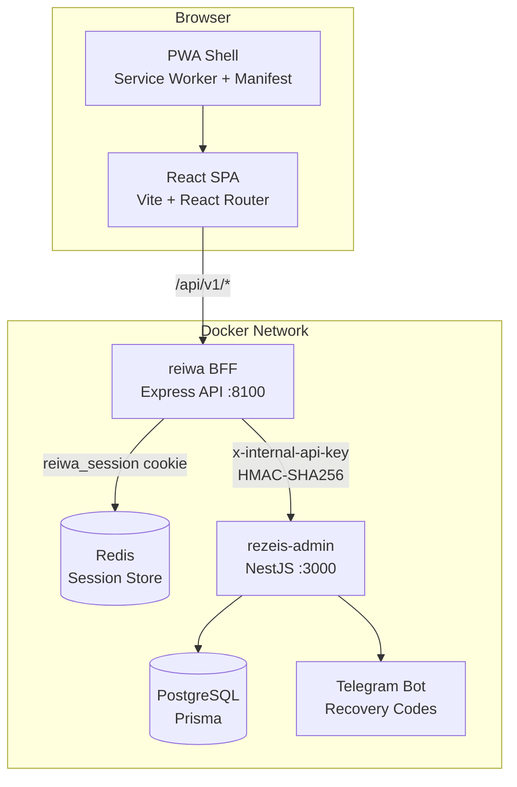
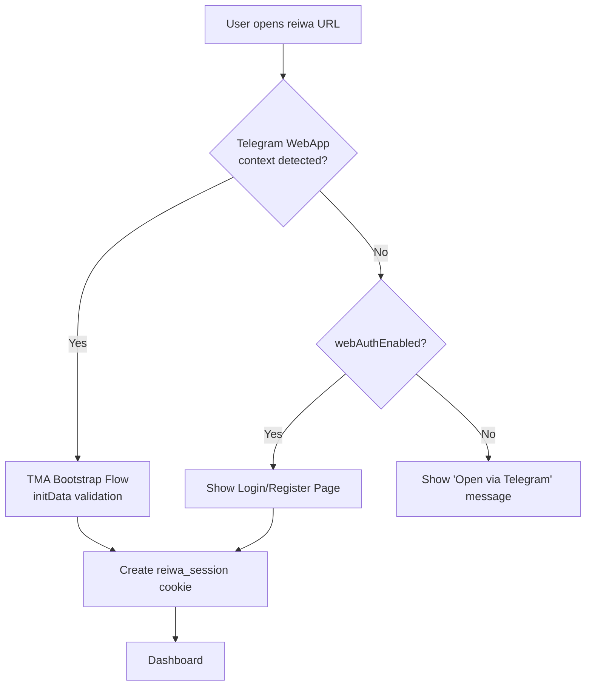
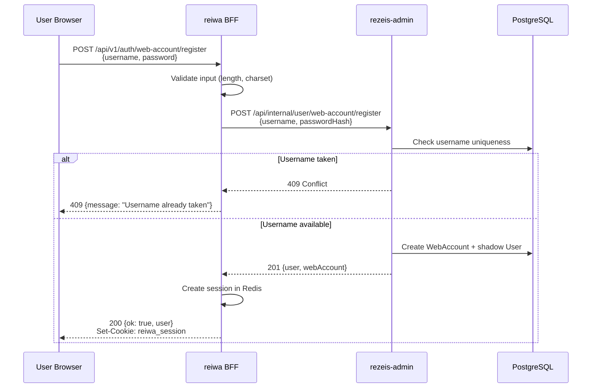
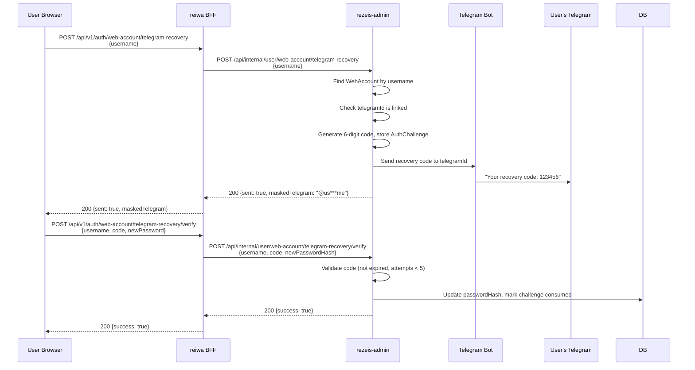
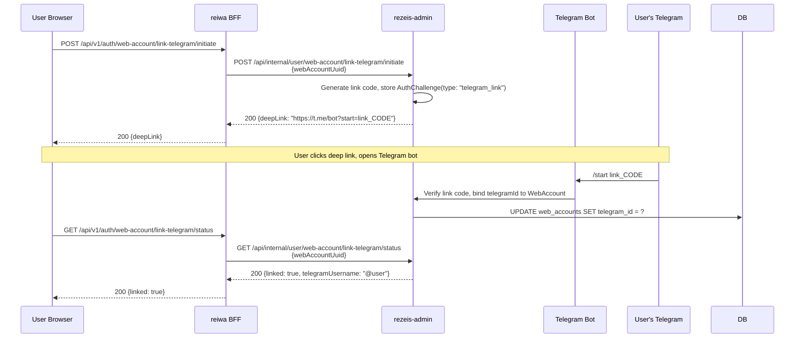
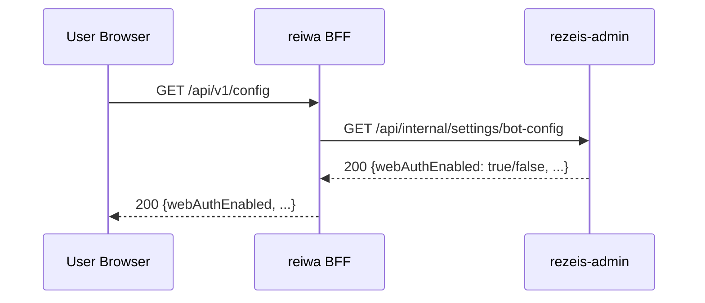

# Design Document: Web Auth PWA

## Overview

This feature transforms the reiwa application from a Telegram Mini App (TMA) into a dual-mode platform accessible both as a TMA and as a standalone Progressive Web App (PWA) via regular browsers. The web mode introduces username/password authentication with optional Telegram account linking for password recovery, optional email linking as a secondary recovery method, and full PWA capabilities (service worker, manifest, offline support, installability).

The architecture maintains reiwa as a stateless frontend+BFF layer that communicates exclusively with rezeis-admin via internal REST API (x-internal-api-key + HMAC signing). All user data, account management, and business logic remain in rezeis-admin. An admin toggle in rezeis-admin controls whether web auth is enabled, allowing operators to disable web registration without redeploying.

## Architecture



### Mode Detection Flow



## Sequence Diagrams

### Web Registration Flow



### Password Recovery via Telegram



### Telegram Account Linking



### Admin Toggle Check



## Components and Interfaces

### Component 1: Web Auth Router (reiwa BFF)

**Purpose**: Handles all web authentication HTTP endpoints — registration, login, password recovery, Telegram linking, email verification.

```typescript
// src/api/routes/web-auth.ts
interface WebAuthRouter {
  // Registration
  "POST /auth/web-account/register": (body: RegisterBody) => AuthResponse;
  
  // Login (existing, enhanced)
  "POST /auth/web-account/sign-in": (body: SignInBody) => AuthResponse;
  
  // Password recovery via Telegram
  "POST /auth/web-account/telegram-recovery": (body: { username: string }) => RecoveryInitResponse;
  "POST /auth/web-account/telegram-recovery/verify": (body: RecoveryVerifyBody) => SuccessResponse;
  
  // Telegram linking
  "POST /auth/web-account/link-telegram/initiate": () => LinkInitResponse;
  "GET /auth/web-account/link-telegram/status": () => LinkStatusResponse;
  
  // Email linking & verification
  "POST /me/email/challenge": (body: { email: string }) => SuccessResponse;
  "PATCH /me/email/verify": (body: { code: string }) => SuccessResponse;
}
```

**Responsibilities**:
- Input validation and sanitization
- Password hashing (bcrypt, client-side pre-hash with SHA-256 for transport)
- Rate limiting per endpoint
- Session creation/management via Redis
- Proxying to rezeis-admin internal API

### Component 2: Bootstrap Page (Enhanced)

**Purpose**: Detects environment (TMA vs browser) and routes to appropriate auth flow.

```typescript
// web/src/features/auth/bootstrap-page.tsx (enhanced)
interface BootstrapLogic {
  detectEnvironment(): "tma" | "web";
  checkWebAuthEnabled(): Promise<boolean>;
  attemptSessionResume(): Promise<ReiwaSession | null>;
  routeToAuth(mode: "tma" | "web"): void;
}
```

**Responsibilities**:
- Detect Telegram WebApp SDK presence
- Check if web auth is enabled via config endpoint
- Resume existing session from cookie
- Redirect to login/register or TMA bootstrap accordingly

### Component 3: PWA Service Worker

**Purpose**: Enables offline support, caching, and installability.

```typescript
// web/public/sw.ts
interface ServiceWorkerStrategy {
  // Cache-first for static assets (JS, CSS, images, fonts)
  staticAssets: "CacheFirst";
  
  // Network-first for API calls with offline fallback
  apiCalls: "NetworkFirst";
  
  // Stale-while-revalidate for config/public data
  publicData: "StaleWhileRevalidate";
  
  // Offline fallback page
  offlineFallback: "/offline.html";
}
```

**Responsibilities**:
- Pre-cache app shell on install
- Cache static assets with versioned cache names
- Provide offline fallback page
- Handle push notifications (future)
- Background sync for failed requests (future)

### Component 4: Admin Settings Integration (rezeis-admin)

**Purpose**: Provides admin toggle for web auth enable/disable.

```typescript
// rezeis-admin: WebRegistrationSetting model
interface WebRegistrationConfig {
  enabled: boolean;                    // Master toggle
  recoveryConfirmMode: "automatic" | "manual"; // How recovery codes are confirmed
}
```

**Responsibilities**:
- Store web auth enabled/disabled state
- Expose via internal API for reiwa to check
- Allow admin panel to toggle without restart

## Data Models

### WebAccount (existing in rezeis-admin, referenced)

```typescript
interface WebAccount {
  uuid: string;           // PK, gen_random_uuid()
  userId: bigint;         // FK → User.telegramId
  username: string;       // Unique, login identifier
  passwordHash: string;   // bcrypt hash
  tokenVersion: number;   // For token invalidation
  requiresPasswordChange: boolean;
  email: string | null;   // Optional, for email recovery
  emailVerified: boolean;
  telegramId: bigint | null;    // Optional linked Telegram account
  telegramUsername: string | null;
  createdAt: Date;
  updatedAt: Date;
}
```

**Validation Rules**:
- `username`: 3-32 chars, alphanumeric + underscore, unique, case-insensitive
- `passwordHash`: bcrypt with cost factor 12
- `email`: valid email format when provided, unique across accounts
- `telegramId`: unique when set (one Telegram per web account)

### AuthChallenge (existing in rezeis-admin, referenced)

```typescript
interface AuthChallenge {
  uuid: string;
  type: "email_verify" | "telegram_recovery" | "telegram_link";
  userId: bigint;
  code: string;           // 6-digit numeric code
  attempts: number;       // Max 5 attempts
  consumed: boolean;
  expiresAt: Date;        // 10 minutes for recovery, 24h for linking
  createdAt: Date;
}
```

**Validation Rules**:
- `code`: 6 random digits, cryptographically secure
- `attempts`: max 5, then challenge is invalidated
- `expiresAt`: 10 min for recovery codes, 24h for link codes
- Only one active challenge per (userId, type) at a time

### ReiwaSession (enhanced)

```typescript
interface ReiwaSession {
  telegramId: string;     // Real or shadow telegram ID
  userId: number;
  name: string;
  username?: string;
  role: string;
  authMethod: "tma" | "web";  // NEW: track how user authenticated
  webAccountUuid?: string;     // NEW: for web-authenticated users
  createdAt: number;
}
```

### PWA Manifest

```typescript
interface WebAppManifest {
  name: "Rezeis VPN";
  short_name: "Rezeis";
  start_url: "/";
  display: "standalone";
  background_color: "#020202";
  theme_color: "#f43f5e";  // Rose-500
  icons: ManifestIcon[];
  categories: ["utilities", "security"];
  orientation: "portrait-primary";
}
```

## Algorithmic Pseudocode

### Registration Algorithm

```typescript
async function registerWebAccount(
  username: string,
  password: string
): Promise<AuthResponse> {
  // Preconditions:
  // - username is 3-32 chars, alphanumeric + underscore
  // - password is 8-128 chars, has uppercase + lowercase + digit
  // - webAuthEnabled === true (checked by middleware)

  // Step 1: Normalize username
  const normalizedUsername = username.toLowerCase().trim();

  // Step 2: Hash password (client sends SHA-256 pre-hash, server does bcrypt)
  const passwordHash = await bcrypt.hash(password, 12);

  // Step 3: Call rezeis-admin to create account
  const result = await adminClient.request("POST", "/api/internal/user/web-account/register", {
    username: normalizedUsername,
    passwordHash,
  });
  // rezeis-admin internally:
  //   - Checks username uniqueness
  //   - Creates shadow User with negative telegramId
  //   - Creates WebAccount linked to shadow User
  //   - Returns user + webAccount data

  // Step 4: Create session
  const sessionId = await sessionStore.create({
    telegramId: String(result.telegramId),
    userId: result.id,
    name: result.name ?? normalizedUsername,
    username: normalizedUsername,
    role: result.role ?? "USER",
    authMethod: "web",
    webAccountUuid: result.webAccountUuid,
  });

  // Step 5: Set cookie and return
  // Postconditions:
  // - WebAccount exists with unique username
  // - Session is stored in Redis with 7-day TTL
  // - Cookie is set with httpOnly, sameSite: lax, secure in production
  return { ok: true, user: result, sessionId };
}
```

### Mode Detection Algorithm

```typescript
function detectAuthMode(): "tma" | "web" {
  // Check for Telegram WebApp SDK
  const tgWebApp = window.Telegram?.WebApp;
  const initData = tgWebApp?.initData;

  // If Telegram SDK is present and has valid initData
  if (tgWebApp && initData && initData.length > 0) {
    return "tma";
  }

  // Otherwise, this is a regular browser access
  return "web";
}

async function bootstrapAuth(mode: "tma" | "web"): Promise<void> {
  // Step 1: Try resuming existing session
  const session = await getSession().catch(() => null);
  if (session) {
    navigate("/dashboard");
    return;
  }

  // Step 2: Route based on mode
  if (mode === "tma") {
    // Use Telegram initData for authentication
    await bootstrapTelegram(initData);
    navigate("/dashboard");
  } else {
    // Check if web auth is enabled
    const config = await getPublicConfig();
    if (!config.webAuthEnabled) {
      // Show "open via Telegram" message
      showTelegramOnlyMessage();
      return;
    }
    // Redirect to login page
    navigate("/login");
  }
}
```

### Service Worker Caching Strategy

```typescript
// sw.ts - Workbox-based service worker
const CACHE_VERSION = "v1";
const STATIC_CACHE = `reiwa-static-${CACHE_VERSION}`;
const API_CACHE = `reiwa-api-${CACHE_VERSION}`;

// Precache app shell
const APP_SHELL = [
  "/",
  "/index.html",
  "/offline.html",
  "/manifest.json",
  // Vite-generated assets are auto-precached via workbox plugin
];

async function handleFetch(event: FetchEvent): Promise<Response> {
  const { request } = event;
  const url = new URL(request.url);

  // API requests: Network-first with timeout
  if (url.pathname.startsWith("/api/")) {
    try {
      const response = await fetchWithTimeout(request, 5000);
      // Cache successful GET responses
      if (request.method === "GET" && response.ok) {
        const cache = await caches.open(API_CACHE);
        cache.put(request, response.clone());
      }
      return response;
    } catch {
      // Fallback to cache for GET requests
      if (request.method === "GET") {
        const cached = await caches.match(request);
        if (cached) return cached;
      }
      return new Response(JSON.stringify({ offline: true }), {
        status: 503,
        headers: { "Content-Type": "application/json" },
      });
    }
  }

  // Static assets: Cache-first
  const cached = await caches.match(request);
  if (cached) return cached;

  try {
    const response = await fetch(request);
    if (response.ok) {
      const cache = await caches.open(STATIC_CACHE);
      cache.put(request, response.clone());
    }
    return response;
  } catch {
    // Offline fallback for navigation requests
    if (request.mode === "navigate") {
      return caches.match("/offline.html") as Promise<Response>;
    }
    throw new Error("Network unavailable");
  }
}
```

## Key Functions with Formal Specifications

### Function 1: registerWebAccount()

```typescript
async function registerWebAccount(
  body: { username: string; password: string },
  deps: { adminClient: AdminClient; sessionStore: SessionStore; config: ReiwaConfig }
): Promise<{ ok: boolean; user: Record<string, unknown> }>
```

**Preconditions:**
- `body.username` is 3-32 characters, matches `/^[a-zA-Z0-9_]+$/`
- `body.password` is 8-128 characters
- `deps.adminClient` is connected and healthy
- `deps.sessionStore` (Redis) is connected
- Web auth is enabled (checked by middleware)

**Postconditions:**
- Returns `{ ok: true, user }` on success
- WebAccount created in rezeis-admin with unique username
- Session stored in Redis with 7-day TTL
- `reiwa_session` cookie set on response
- On username conflict: throws 409 error
- On validation failure: throws 400 error

**Loop Invariants:** N/A (no loops)

### Function 2: initiateTelegramRecovery()

```typescript
async function initiateTelegramRecovery(
  username: string,
  deps: { adminClient: AdminClient }
): Promise<{ sent: boolean; maskedTelegram?: string }>
```

**Preconditions:**
- `username` is non-empty string
- `deps.adminClient` is connected

**Postconditions:**
- Always returns 200 (anti-enumeration: same response whether user exists or not)
- If user exists and has linked Telegram: AuthChallenge created, code sent via bot
- If user doesn't exist or no Telegram linked: no side effects, still returns `{ sent: true }`
- Challenge expires in 10 minutes
- Only one active recovery challenge per user at a time (previous ones invalidated)

**Loop Invariants:** N/A

### Function 3: verifyTelegramRecoveryCode()

```typescript
async function verifyTelegramRecoveryCode(
  body: { username: string; code: string; newPassword: string },
  deps: { adminClient: AdminClient }
): Promise<{ success: boolean }>
```

**Preconditions:**
- `body.username` is non-empty
- `body.code` is 6-digit string
- `body.newPassword` meets password policy (8-128 chars)
- Active AuthChallenge exists for this user with type "telegram_recovery"

**Postconditions:**
- If code valid and not expired: password updated, challenge consumed, returns `{ success: true }`
- If code invalid: attempts incremented, returns 400 error
- If attempts >= 5: challenge invalidated, returns 400 "Too many attempts"
- If challenge expired: returns 400 "Code expired"
- Password hash updated with bcrypt cost 12

**Loop Invariants:** N/A

### Function 4: detectAndRouteAuth()

```typescript
function detectAndRouteAuth(
  telegramWebApp: TelegramWebApp | undefined,
  config: PublicConfig,
  existingSession: ReiwaSession | null
): AuthRoute
```

**Preconditions:**
- `config` has been fetched from `/api/v1/config`
- Function is called on app initialization

**Postconditions:**
- If `existingSession` is valid: returns `{ route: "/dashboard" }`
- If Telegram WebApp detected with initData: returns `{ route: "/bootstrap", mode: "tma" }`
- If no TMA and `config.webAuthEnabled === true`: returns `{ route: "/login", mode: "web" }`
- If no TMA and `config.webAuthEnabled === false`: returns `{ route: "/telegram-only" }`
- Exactly one route is returned (exhaustive)

**Loop Invariants:** N/A

## Example Usage

```typescript
// Example 1: Web registration from frontend
const handleRegister = async (username: string, password: string) => {
  const response = await apiClient.post("/auth/web-account/register", {
    username,
    password, // SHA-256 pre-hashed on client for transport security
  });
  // Cookie is automatically set by browser
  navigate("/dashboard");
};

// Example 2: Password recovery flow
const handleRecovery = async (username: string) => {
  const { maskedTelegram } = await apiClient.post(
    "/auth/web-account/telegram-recovery",
    { username }
  );
  // Show UI: "Code sent to Telegram @us***me"
  setRecoveryState({ step: "verify", maskedTelegram });
};

const handleVerifyCode = async (code: string, newPassword: string) => {
  await apiClient.post("/auth/web-account/telegram-recovery/verify", {
    username: recoveryState.username,
    code,
    newPassword,
  });
  // Show success, redirect to login
  navigate("/login", { state: { message: "Password reset successful" } });
};

// Example 3: Service worker registration
if ("serviceWorker" in navigator) {
  window.addEventListener("load", () => {
    navigator.serviceWorker.register("/sw.js").then((reg) => {
      console.log("SW registered:", reg.scope);
    });
  });
}

// Example 4: Mode detection in bootstrap
useEffect(() => {
  const mode = detectAuthMode();
  if (mode === "tma") {
    // Existing TMA flow
    bootstrapTelegram(initData);
  } else {
    // New web flow
    checkWebAuthEnabled().then((enabled) => {
      if (enabled) navigate("/login");
      else setPhase("telegram-only");
    });
  }
}, []);
```

## Correctness Properties

1. **∀ username: registerWebAccount(username) succeeds ⟹ username is unique in DB**
   - No two WebAccounts can share the same normalized username

2. **∀ session: session.authMethod === "web" ⟹ ∃ WebAccount with session.webAccountUuid**
   - Every web-authenticated session references a valid WebAccount

3. **∀ challenge: challenge.attempts ≥ 5 ⟹ challenge is invalidated**
   - Brute force protection: max 5 attempts per recovery code

4. **∀ request to protected route: valid reiwa_session cookie required**
   - Both TMA and web sessions use the same cookie-based auth mechanism

5. **webAuthEnabled === false ⟹ all /auth/web-account/* endpoints return 403**
   - Admin toggle immediately blocks all web auth operations

6. **∀ navigation request when offline: service worker returns /offline.html**
   - PWA always shows meaningful content, never browser error page

7. **∀ WebAccount with telegramId: telegramId is unique across all WebAccounts**
   - One Telegram account can only be linked to one web account

## Error Handling

### Error Scenario 1: Username Already Taken

**Condition**: User attempts registration with existing username
**Response**: 409 Conflict with message "Username already taken"
**Recovery**: User chooses different username; UI suggests alternatives

### Error Scenario 2: Invalid Recovery Code

**Condition**: User enters wrong 6-digit code during password recovery
**Response**: 400 Bad Request with remaining attempts count
**Recovery**: User can retry (up to 5 attempts), then must request new code

### Error Scenario 3: Telegram Not Linked (Recovery Attempt)

**Condition**: User requests Telegram recovery but has no linked Telegram account
**Response**: 200 OK with `{ sent: true }` (anti-enumeration)
**Recovery**: User must use email recovery if email is linked, or contact support

### Error Scenario 4: Web Auth Disabled Mid-Session

**Condition**: Admin disables web auth while user has active session
**Response**: Existing sessions remain valid until expiry; new logins/registrations blocked
**Recovery**: User can continue using existing session; must use TMA after session expires

### Error Scenario 5: Service Worker Cache Stale

**Condition**: New deployment with breaking API changes, user has stale SW cache
**Response**: SW detects version mismatch, triggers skipWaiting + clients.claim
**Recovery**: Automatic cache invalidation on SW update; force-refresh clears all caches

### Error Scenario 6: Redis Unavailable

**Condition**: Redis connection lost, sessions cannot be created/validated
**Response**: 503 Service Unavailable for auth endpoints
**Recovery**: Express health check reports unhealthy; Docker restarts container; sessions resume on reconnect

## Testing Strategy

### Unit Testing Approach

- Test input validation functions (username format, password strength)
- Test mode detection logic (TMA vs web)
- Test session creation/destruction
- Test rate limiter behavior
- Mock AdminClient for isolated BFF testing

### Property-Based Testing Approach

**Property Test Library**: fast-check

- **Username normalization**: ∀ valid username strings, normalize(username) is idempotent
- **Password hashing**: ∀ passwords, bcrypt.compare(password, hash(password)) === true
- **Session lifecycle**: ∀ sessions, create → get returns same data; destroy → get returns null
- **Rate limiting**: ∀ request sequences exceeding limit, subsequent requests are rejected

### Integration Testing Approach

- End-to-end registration → login → session validation flow
- Recovery code generation → verification → password update flow
- Telegram linking initiation → bot confirmation → status check flow
- Admin toggle: enable → register succeeds; disable → register blocked
- PWA: service worker install → cache population → offline navigation

## Performance Considerations

- **Session lookup**: Redis GET with O(1) complexity; session refresh extends TTL without re-serialization
- **Password hashing**: bcrypt cost 12 (~250ms per hash); acceptable for auth endpoints with rate limiting
- **Service Worker**: Pre-cache critical path (app shell ~200KB gzipped); lazy-cache API responses
- **Config caching**: `webAuthEnabled` flag cached in reiwa memory with 60s TTL to avoid per-request admin calls
- **Bundle splitting**: Login/Register pages lazy-loaded; not included in main bundle for TMA users

## Security Considerations

- **Rate limiting**: Auth endpoints: 20 req/15min per IP (existing `authLimiter`); registration: 5 req/hour per IP
- **Brute force protection**: Account lockout after 10 failed login attempts (30-min cooldown, managed by rezeis-admin)
- **CSRF**: SameSite=Lax cookies + Origin header validation; no CSRF tokens needed for JSON API
- **Password transport**: Client SHA-256 pre-hashes password before sending (defense-in-depth for non-HTTPS dev); server bcrypt-hashes the pre-hash
- **Anti-enumeration**: Recovery endpoints always return success regardless of account existence
- **Session security**: httpOnly, Secure (production), SameSite=Lax; 7-day TTL with sliding expiration
- **Input sanitization**: Username stripped to alphanumeric+underscore; all inputs validated with zod schemas
- **Content Security Policy**: Strict CSP headers via helmet; no inline scripts in PWA

## Dependencies

### reiwa (BFF + Frontend)
- `express` — HTTP server (existing)
- `bcrypt` / `bcryptjs` — Password hashing
- `vite-plugin-pwa` — PWA manifest + service worker generation
- `workbox-*` — Service worker caching strategies
- `react-router-dom` — Client routing (existing)
- `framer-motion` / `motion` — Animations (existing)
- `@tanstack/react-query` — Data fetching (existing)
- `zod` — Input validation (existing)

### rezeis-admin (referenced, not modified in reiwa)
- `WebAccount` model — User credentials storage
- `AuthChallenge` model — Recovery/linking codes
- `WebRegistrationSetting` model — Admin toggle
- Telegram Bot API — Sending recovery codes
